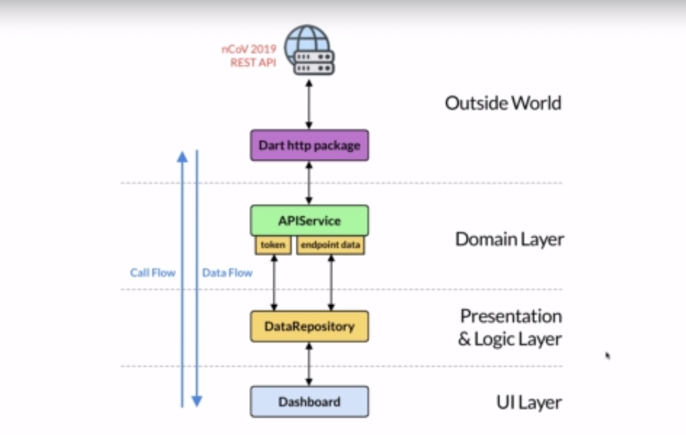

#### Build a Coronavirus Tracking App

  
  
  
  <h1 align="center"> App Structure </h1>

  

  

  
  
  <h1 align="center"> API Structure </h1>

For help getting started with Flutter, view our
[online documentation](https://flutter.dev/docs), which offers tutorials,
samples, guidance on mobile development, and a full API reference.
